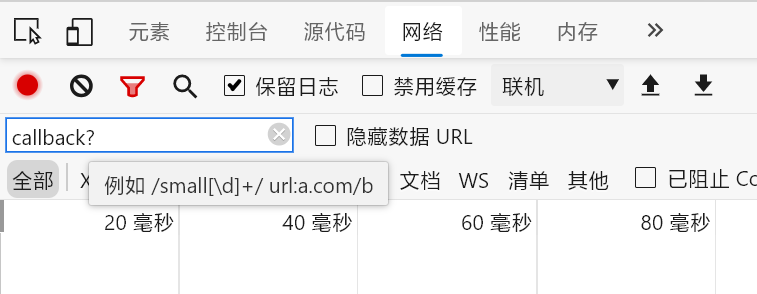

# 获取 Pixiv `refresh_token`

> 本文为 https://gist.github.com/ZipFile/c9ebedb224406f4f11845ab700124362 中部分内容的翻译。原作者保留所有权。

1. 获取下面的 `pixiv_auth.py` 文件，执行命令：`python pixiv_auth.py login`，电脑浏览器将会弹出，并显示 Pixiv 登录页。
2. 按下 `F12`，切换到网络选项卡，勾选“保留日志”，并在过滤文本框中输入 `callback?`，如图。

3. 在网页中登录 Pixiv，然后，您会在请求列表中看到一条类似 `https://app-api.pixiv.net/web/v1/users/auth/pixiv/callback?state=...&code=...` 的请求。将 `code` 参数的内容复制到刚才执行脚本的终端中，按下回车。
4. 稍后，`auth_token` 和 `refresh_token` 将会被输出。

提示：`code` 的有效期很短，因此请尽快操作。

```python
# pixiv_auth.py
#!/usr/bin/env python

from argparse import ArgumentParser
from base64 import urlsafe_b64encode
from hashlib import sha256
from pprint import pprint
from secrets import token_urlsafe
from sys import exit
from urllib.parse import urlencode
from webbrowser import open as open_url

import requests

# Latest app version can be found using GET /v1/application-info/android
USER_AGENT = "PixivAndroidApp/5.0.234 (Android 11; Pixel 5)"
REDIRECT_URI = "https://app-api.pixiv.net/web/v1/users/auth/pixiv/callback"
LOGIN_URL = "https://app-api.pixiv.net/web/v1/login"
AUTH_TOKEN_URL = "https://oauth.secure.pixiv.net/auth/token"
CLIENT_ID = "MOBrBDS8blbauoSck0ZfDbtuzpyT"
CLIENT_SECRET = "lsACyCD94FhDUtGTXi3QzcFE2uU1hqtDaKeqrdwj"


def s256(data):
    """S256 transformation method."""

    return urlsafe_b64encode(sha256(data).digest()).rstrip(b"=").decode("ascii")


def oauth_pkce(transform):
    """Proof Key for Code Exchange by OAuth Public Clients (RFC7636)."""

    code_verifier = token_urlsafe(32)
    code_challenge = transform(code_verifier.encode("ascii"))

    return code_verifier, code_challenge


def print_auth_token_response(response):
    data = response.json()

    try:
        access_token = data["access_token"]
        refresh_token = data["refresh_token"]
    except KeyError:
        print("error:")
        pprint(data)
        exit(1)

    print("access_token:", access_token)
    print("refresh_token:", refresh_token)
    print("expires_in:", data.get("expires_in", 0))


def login():
    code_verifier, code_challenge = oauth_pkce(s256)
    login_params = {
        "code_challenge": code_challenge,
        "code_challenge_method": "S256",
        "client": "pixiv-android",
    }

    open_url(f"{LOGIN_URL}?{urlencode(login_params)}")

    try:
        code = input("code: ").strip()
    except (EOFError, KeyboardInterrupt):
        return

    response = requests.post(
        AUTH_TOKEN_URL,
        data={
            "client_id": CLIENT_ID,
            "client_secret": CLIENT_SECRET,
            "code": code,
            "code_verifier": code_verifier,
            "grant_type": "authorization_code",
            "include_policy": "true",
            "redirect_uri": REDIRECT_URI,
        },
        headers={"User-Agent": USER_AGENT},
    )

    print_auth_token_response(response)


def refresh(refresh_token):
    response = requests.post(
        AUTH_TOKEN_URL,
        data={
            "client_id": CLIENT_ID,
            "client_secret": CLIENT_SECRET,
            "grant_type": "refresh_token",
            "include_policy": "true",
            "refresh_token": refresh_token,
        },
        headers={"User-Agent": USER_AGENT},
    )
    print_auth_token_response(response)


def main():
    parser = ArgumentParser()
    subparsers = parser.add_subparsers()
    parser.set_defaults(func=lambda _: parser.print_usage())
    login_parser = subparsers.add_parser("login")
    login_parser.set_defaults(func=lambda _: login())
    refresh_parser = subparsers.add_parser("refresh")
    refresh_parser.add_argument("refresh_token")
    refresh_parser.set_defaults(func=lambda ns: refresh(ns.refresh_token))
    args = parser.parse_args()
    args.func(args)


if __name__ == "__main__":
    main()
```